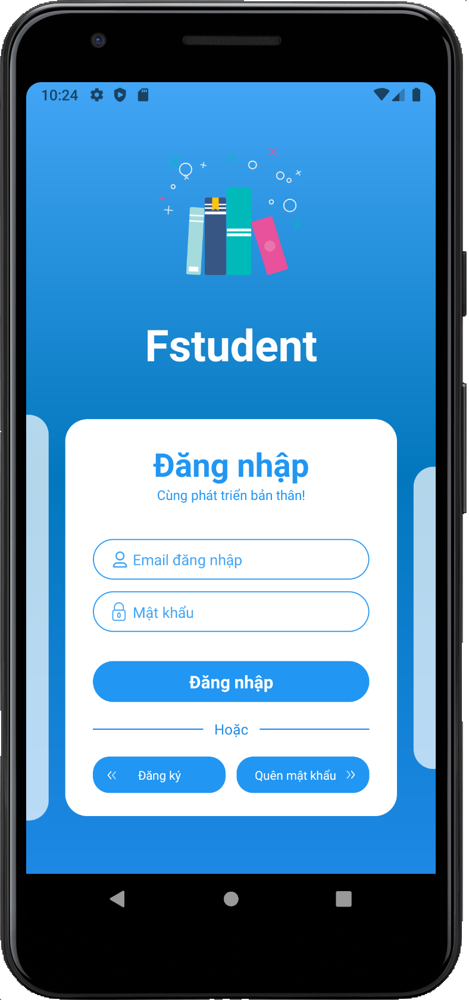
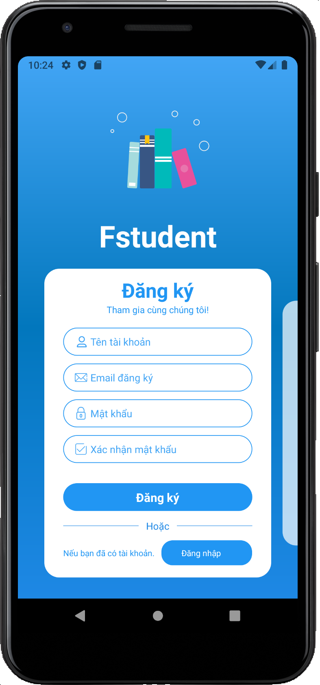
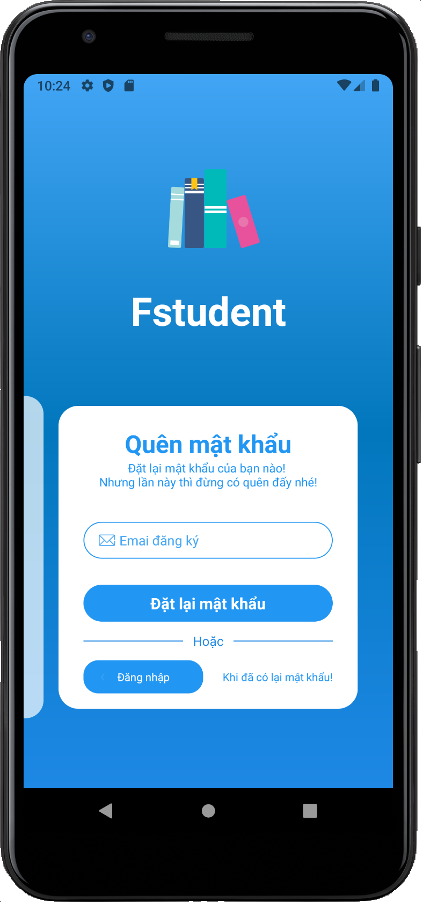
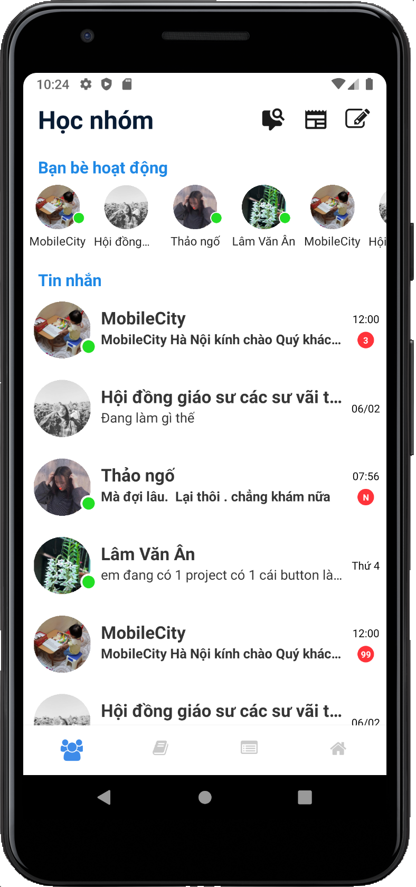
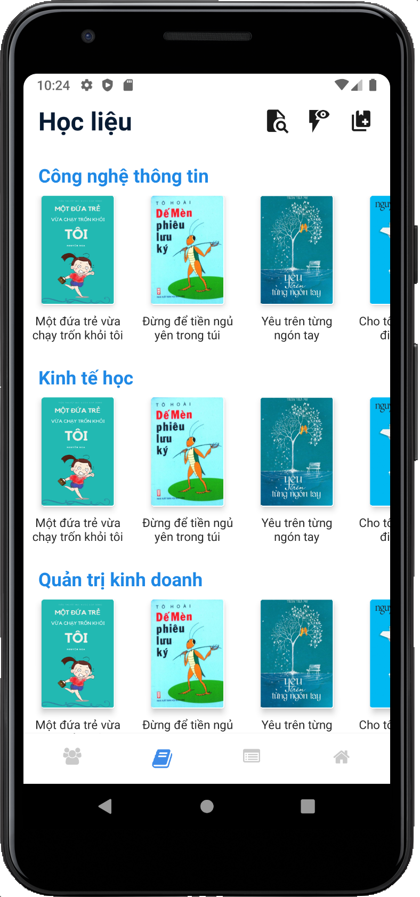
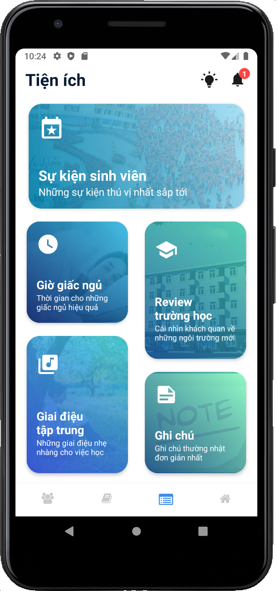
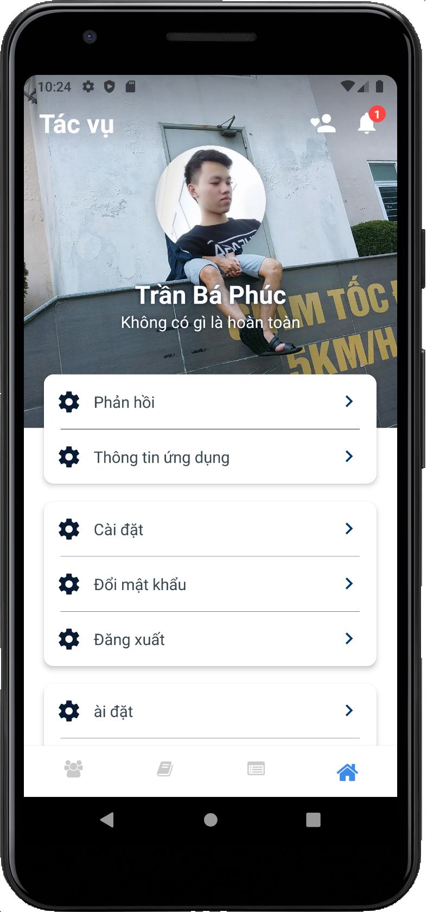

# FStudent (Unfinished)

Application to support students in learning and practice

## Features 
* The library of collected material or the author is the student
* Communication network
* Support utilities

## Libraries 
* [React Navigation](https://reactnavigation.org/)
* [Lottie for React Native, iOS, and Android](https://github.com/lottie-react-native/lottie-react-native)
* [React Native Reanimated](https://github.com/software-mansion/react-native-reanimated)
* [FastImage](https://github.com/DylanVann/react-native-fast-image)
* [React Native Linear Gradient](https://github.com/react-native-linear-gradient/react-native-linear-gradient)
* [React Native Size Matters](https://github.com/nirsky/react-native-size-matters)
* [React Native Vector Icons](https://github.com/oblador/react-native-vector-icons)
* [React Native Snap Carousel](https://github.com/meliorence/react-native-snap-carousel)

## Screen Shot
|  |  |  |
| - | - | - |

|  |  |  | |
| - | - | - | - |

## Support
* Android
* IOS

## Development team
* [Phuc Tran Ba](https://github.com/phuctranba)

## Development purpose
Personal projects
